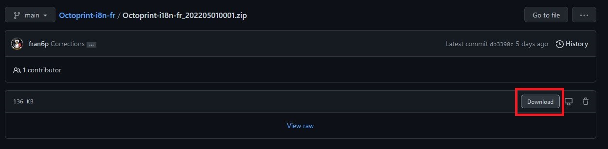
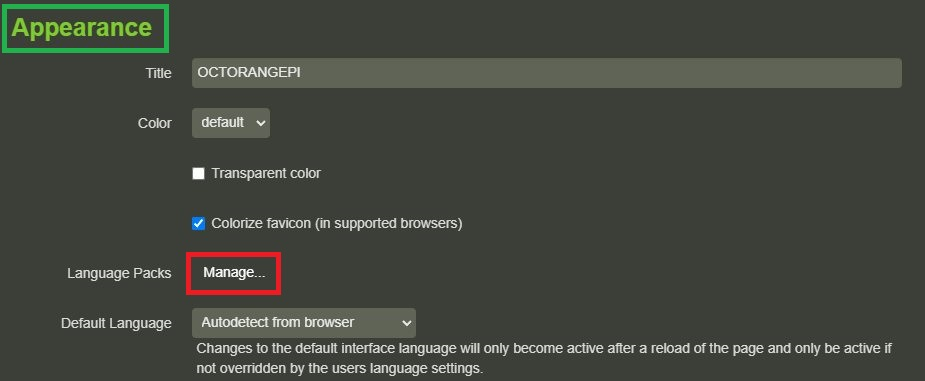
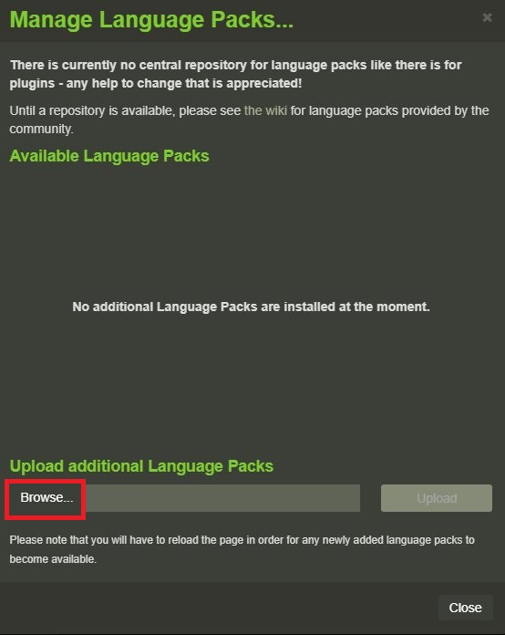
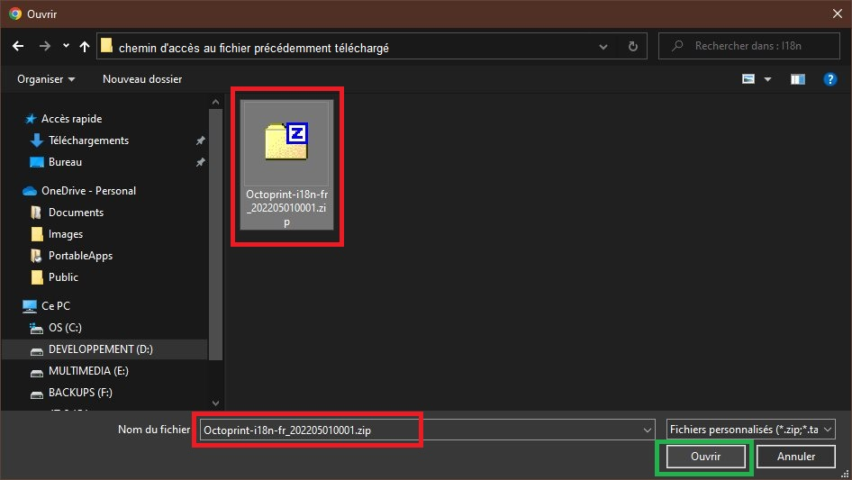
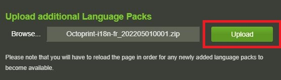
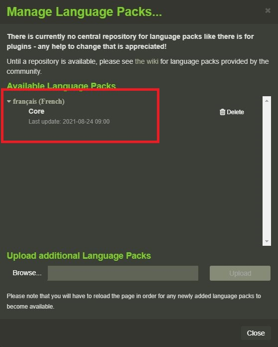
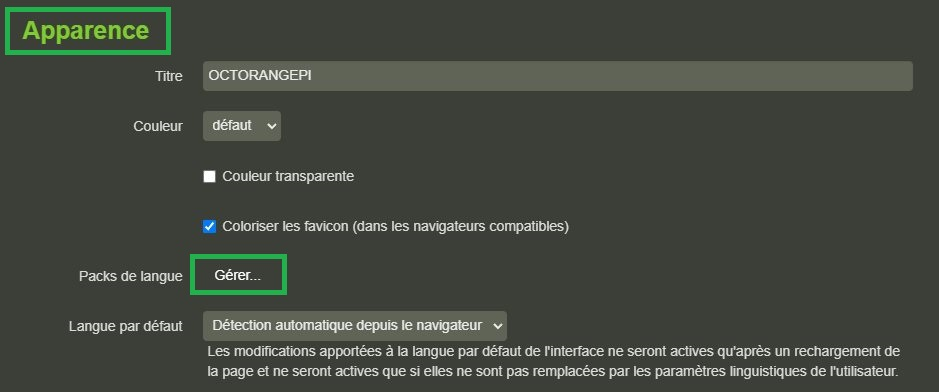
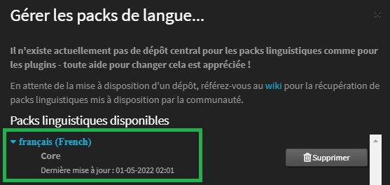

# Octoprint-i8n-fr

 Traduction française d'Octoprint ([lesimprimantes3d.fr] (https://www.lesimprimantes3d.fr/forum/topic/5253-pack-fr/))
 
* version 1.4.X (la dernière étant la 1.4.2)
* version 1.5.X (la dernière étant la 1.5.2)
* version 1.6.X (la dernière étant la 1.6.1)
* version 1.7.X (la dernière étant la 1.7.3)
* version 1.8.X (actuellement au 20220521, la 1.8.0)

Le fichier .zip est à téléverser sur l'Octoprint via Paramètres\Apparence -> Packs linguistiques [Gérer] (Settings>Appearence> Language Packs).

> Un redémarrage du serveur permet de prendre en compte les modifications si un simple CTRL + F5 ne donne pas satisfaction.

Pour la **version 1.4.x** d'Octoprint, utiliser le fichier **Octoprint-i18n-fr_202010201200.zip** (fonctionne aussi avec la dernière version 1.5.2 mais est incomplet).

Pour la **version 1.5.2** d'Octoprint, utiliser le fichier **Octoprint-i18n-fr_202012131200.zip** (fonctionne également avec la version en cours, 1.6.1, mais n'est pas complet.

Pour la **version 1.6.1** d'Octoprint, utiliser le fichier **Octoprint-i18n-fr_202108240700.zip** (complet, fonctionne également avec la version en cours, 1.7.3, mais n'est pas complet :smirk: ).

Pour la **version 1.7.3** d'Octoprint, utiliser le fichier **Octoprint-i18n-fr_202205010001.zip** (complet).

Pour la **version actuelle 1.8.0** d'Octoprint, utiliser le fichier **OctoPrint-i18n-fr_202205221530.zip** (complet mais les menus restent en anglais :confounded: :astonished: (*je continue d'investiguer sur le pourquoi du comment avant de remonter un «bug» sur le Github Octoprint*)

## En pratique

- Télécharger la version du pack linguistique en fonction de la version d'Octoprint installée en cliquant sur le fichier d'extension «.zip» puis clic sur le bouton «Download» :

- Dans Octoprint, accéder aux paramêtres, section «Appearence»
  - Clic sur le bouton «Manage» :
  - 
  - Clic sur le bouton «Browse» : 
  - 
  - La fenêtre de sélection de fichiers s'ouvre, se déplacer là où le fichier précédent a été téléchargé et valider ce choix :
  
  - Valider le téléversement sur Octoprint en cliquant sur «Upload» :
  - 
  - Le pack de langue française doit apparaitre dans la liste :
  - 

## IMPORTANT:

> Ne pas oublier après avoir téléversé le pack linguistique de **rafraichir la page** ( CTRL + F5 ) ou de **redémarrer Octoprint** afin que la langue française soit prise en compte ;-)  

- Une fois la page rechargée (ou après un redémarrage normalement non nécessaire, on n'est pas sous Windows :smirk: )
  - L'interface d'Octoprint devrait être dans la langue de Molière. Exemple avec Paramètres > Apparence
  -  
  -   

# :smiley: 

